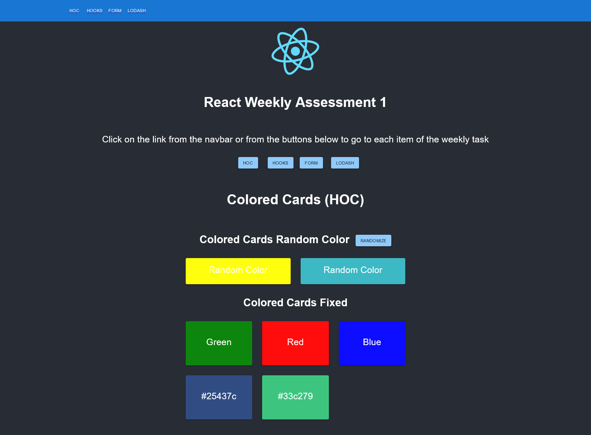
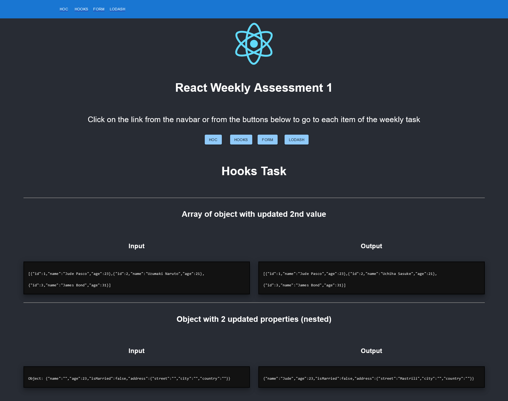
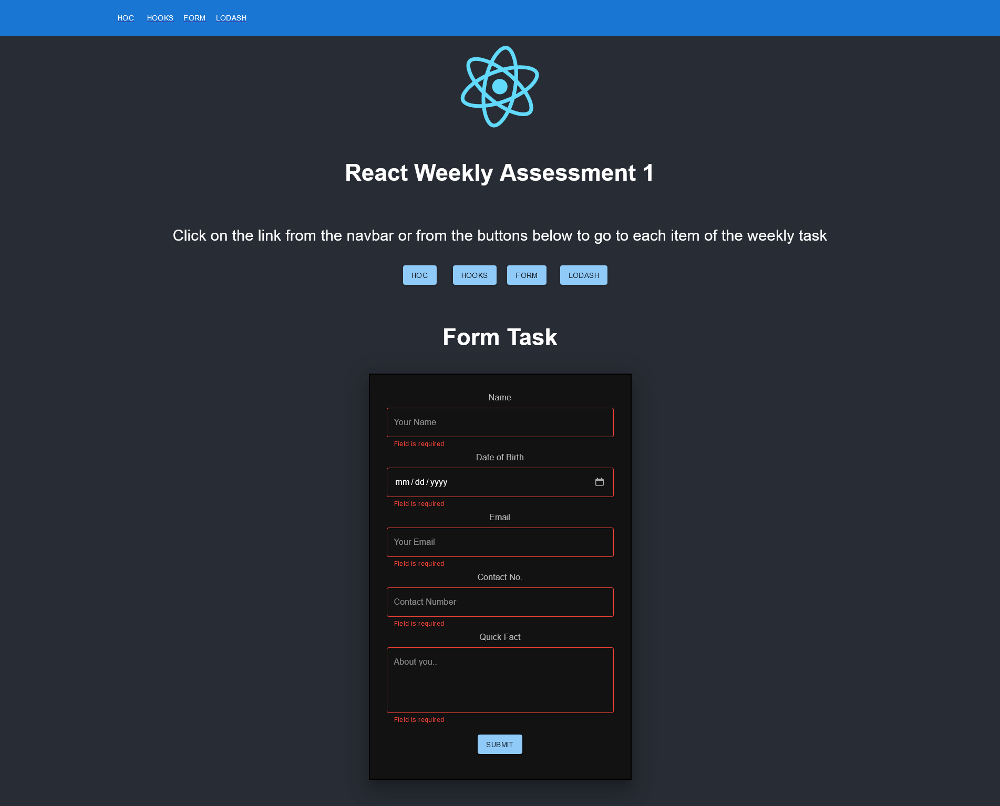
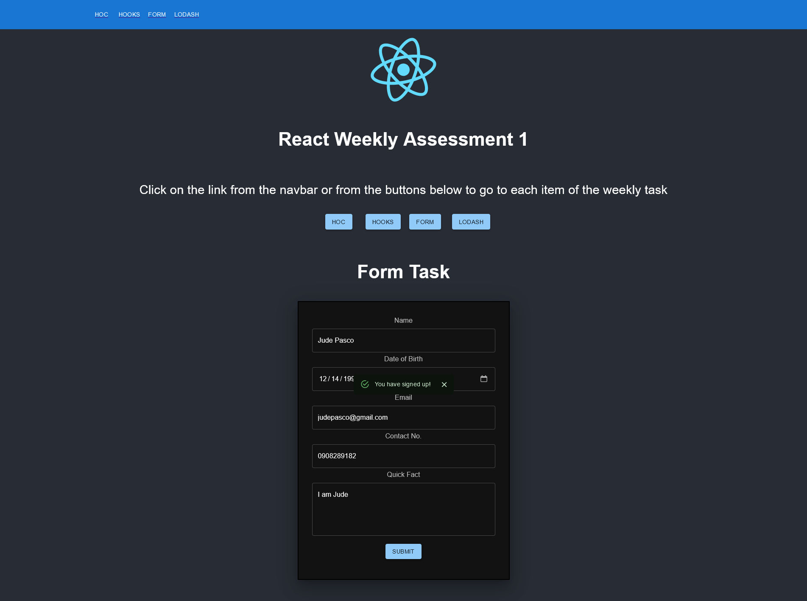
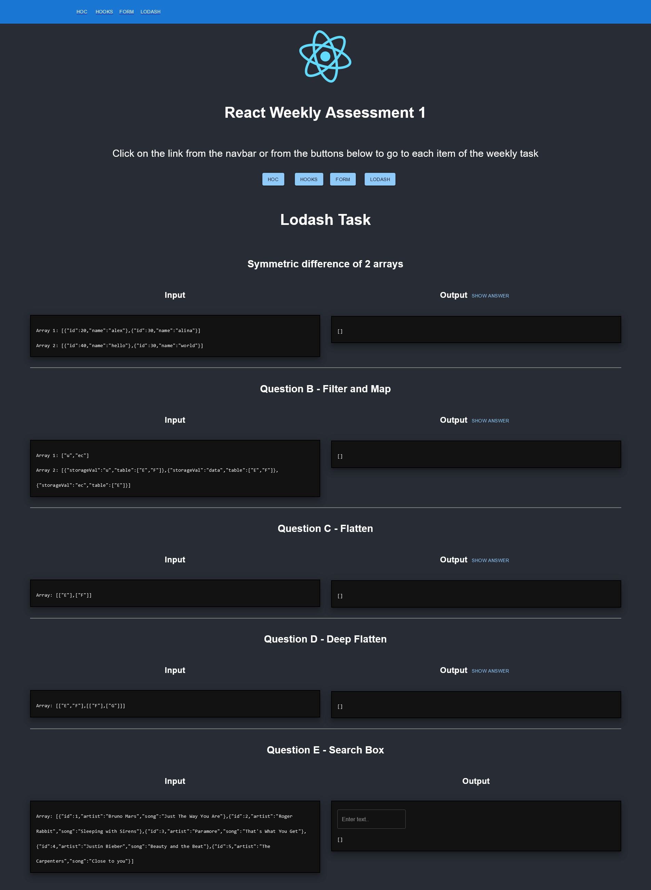
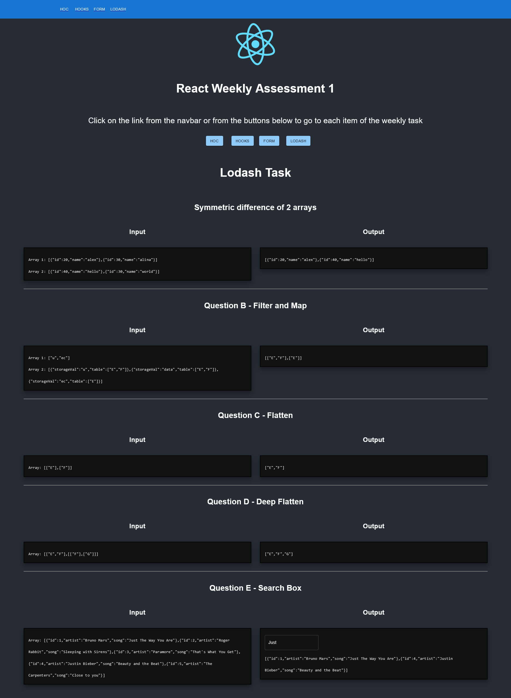

# React Weekly Task 1
## Description
React Weekly Assessment 1  

The assessment contains a page for each task which can be routed using the navbar or the buttons.  

### HOC
In the HOC task, 2 cards are shown with random colors and a button to randomize is again. There are also cards with fixed colors but takes the color property as a prop from the parent component to the HOC. 

### Hooks
Two blocks of code are shown here to show the difference of the initial state of the given array and object.

### Form
The form here is created using functional components and gotten from the previous work (but without a modal notification). Upon submission with validated values, a snackbar notification will appear.

### Lodash
Blocked of code are also shown here with buttons to show the answer to the problems. The fifth (5th) problem regarding the search box accepts input and displays results on each type or input from the keyboard.

## Author
Jude Pasco  
Cohor #28

## Screenshots

### HOC

### Hooks

### Form

### Lodash

